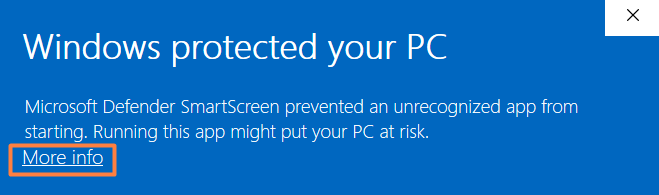

<p align="center">
    <picture>
        <source media="(prefers-color-scheme: dark)">
        
    </picture>
    <br>
    <br>
    <b style="font-size: 16px">© 2022-2025 by AEYCEN / TRAYVED</b>
    <br>
    Better calc than guess.
    <br>
</p>

---

<p style="font-size: 17px">Structure destruction calculator for Ark: Survival Evolved and Ark: Survival Ascended.</p>


# 💪🏼 Features

Some of the features the calculator provides are:

* 💥 **Precise calculation**: Instantly calculates how many explosives or shots are needed to destroy any structure based on its HP, material and weapon type
* 📊 **Supports multiple weapons & materials**: Includes C4, Rocket Launcher, Tek Rifle, Cannon, Grenades, Tek Grenades and Catapult; calculates for Wood, Stone, Metal and Tek structures
* 🔢 **Detailed resource cost**: Shows the exact resource cost to craft the required ammo
* ✨ **Considers tool quality**: For weapons that can exist in a better quality, the respective percentage value can also be specified
* ⚙️ **6x cave damage option**: Adjusts all damage values when the structure is inside a cave
* 🎨 **Colored & formatted output**: Uses ANSI codes for better readability in terminal (bold, colors etc.)
* 🦖 **Customized mode for Beginners Next Gen**: Integrated BNG mode customized for the most popular ASE Beginner Server
* 🪶 **Lightweight console application**: Runs directly from terminal, fast and minimal

# 🌐 ArkCulator Online


ArkCulator Online is the web version of ArkCulator. It is hosted on GitHub Pages and can be directly accessed via:

- [aeycen.github.io/ArkCulator](https://aeycen.github.io/ArkCulator/)

The current ArkCulator Online version is `web-v1.1 (21.07.2025)`

### 📑 Changelog

    21.07.2025 | web-v1.1  - update result on number input
                           - limit health & quality input
                           - bug fixes

    17.07.2025 | web-v1.0  - initial release


# 📟 ArkCulator


## 🛠️ Installation

ArkCulator does not need any installation in order to run. You can execute the .exe file anywhere.

After executing the file the first time you will be prompted by the Windows Defender SmartScreen that the file is unknown to Microsoft and may be harmful.
This is expected and can only be avoided if I, as a developer, pay at least €300 annually for a signing certificate.
As I do not plan to pay for this, you will now have to endure this message and first click on “More info” and then “Run anyway”.



> [!TIP]
> You are able to verify the source code of the executable inside the C++ file in the `cpp` folder.


<a name="installation"></a>


## 🚀 Usage

The calculator will ask you questions in order to calculate the amount of ammunition you need to destroy a structure.
Always confirm with `ENTER` after an input. After answering a question, your answer will be displayed in front of the next question.

1. In what mode do yuo want to use ArkCulator?

   `Enter calculator mode [ENTER for normal / bng for Beginners Next Gen]`

   Simply press the `ENTER` key for the normal mode or type `bng` for the Beginners Next Gen servers adjusted mode.   


2. What weapon do you want to destroy with?

   ```
   Enter weapon:
      1 - C4
      2 - Cannon
      3 - Catapult
      4 - Grenade
      5 - Rocket Launcher
      6 - Tek Grenade
      7 - Tek Rifle
   ```

    Enter the respective number or the name of the weapon (e.g. `4` or `grenade` for grenades)

> [!NOTE]
> If you selected the tek rifle, it will proceed to ask you of what quality it is. Questioned is the percentage of damage. For a normal tek rifle just enter `100`.


3. What type of Structure you want to destroy?

   `Enter material of structure [wood/stone/metal/tek]`

    You can either write the full word or just the first letter (e.g. `t` for tek)

> [!NOTE]
> If the selected structure type is indestructible by the selected weapon, you will receive a message before you can make any further entries.


4. How many HP has this structure right now?

   `Enter HP of structure`

    A number between 1 and 250'000


5. Is the structure you want to attack in range of the 6x cave damage multiplier?

   `Cave damage? [yes/no]`

    Enter yes, no or just the respective first letter of the word (e.g. `n` for no)


Now you will see how much ammunition you need to destroy the structure with the selected weapon, like for example:

`[Grenade|Wood|10000 HP|No Cave] Grenades needed to destroy: 13`

In addition, you will see what production costs you can expect in order to produce the specified amount of ammunition:
```
Resources needed to craft:
390 Gunpowder
195 Fiber
65 Hide
26 Metal
52 Oil
260 Stone
```

The process then starts at the weapon question again. It will be asked again directly for the next calculation.

You can end the application with the key combination `Ctrl+C` or just by closing the window.


## 🪲 Troubleshooting

*There aren't any known issues. Feel free to let me know if you stumble upon any...*


## 🔰 Version

This README file is associated with ArkCulator `v5.3 (15.07.25)`


### ⏫ Upgrading the Version

To upgrade ArkCulator to a newer version, simply download the newer version from the releases tab on GitHub and execute it.
Notice that you will be prompted by the Defender SmartScreen again the first time you run the new version.


### 📑 Changelog

    15.07.2025 | v5.3   - added new weapon type: tek grenade
                        - support for every tek rifle quality
                        - integrated Beginners Next Gen mode
                        - added ability to answer with weapon name instead of just number
                        - increased max stucture HP input to 250'000
   
    11.07.2025 | v5.2   - finished executable release
                        - styling improvements
                        - added tek rifle element cost calculation
                        - added auto-reset after calculation
                        - added individual ammo translations

    09.07.2025 | v5.1   - added input validations
                        - bug fixes
                        - added bng (Beginners Next Gen) version

    09.03.2024 | v5.0   - added text coloration and display of user input history
                        - user input process simplified

    15.10.2023 | v4.1   - added branding and description

    14.10.2023 | v4.0   - code cleanup
                        - code efficiency increased

    26.08.2022 | v3.0   - changed user input process

    29.07.2022 | v2.0   - added new weapon types: cannon, grenade and catapult 

    28.07.2022 | v1.0   - initial c++ console application release


# 💫 Contact

**Initial development, Conception and Idea**
- TRAYVED (Discord: trayved)

**Further Development, Revamp-Conception & Support**
- [AEYCEN](https://github.com/AEYCEN) (Discord: aeycen)

Create an issue ticket on GitHub for bug reports and feature requests or join our [Discord server](https://discord.gg/N55gSQcVEC) on the `Tech-Support` channel for individual support.


# 📜 License

ArkCulator is licensed under the MIT licence. Please see the [license file](LICENSE) for more information.
[tl;dr](https://www.tldrlegal.com/license/mit-license) you can do whatever you want as long as you include the original copyright and license notice in any copy of the software/source.
Any modifications to ArkCulator must also be made available under the MIT along with install & usage instructions.
